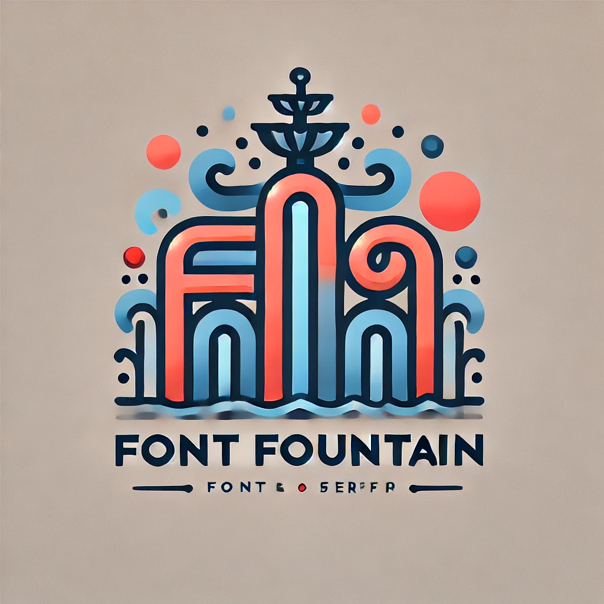

  

  # Font Fountain

## 🎨 Project Overview

Font Fountain is an interactive typography exploration application that allows designers and typography enthusiasts to discover, preview, and experiment with a curated collection of fonts.

## 🖌️ Design Philosophy

Our design embraces a minimalist and modern aesthetic, ensuring that the fonts themselves remain the primary visual focus. 

### Color Palette
- **Primary**: Deep Navy Blue (#1A1A2E)
- **Secondary**: Dark Blue (#16213E)
- **Accent**: Vibrant Blue (#0F3460)
- **Highlight**: Coral Red (#E94560)

### Typography Principles
- Clean, readable interfaces
- Emphasis on font diversity
- Intuitive user interactions

### Installation
1. Clone the repository
2. Run 'npm ci' and 'npm run dev'
3. Start exploring fonts!

